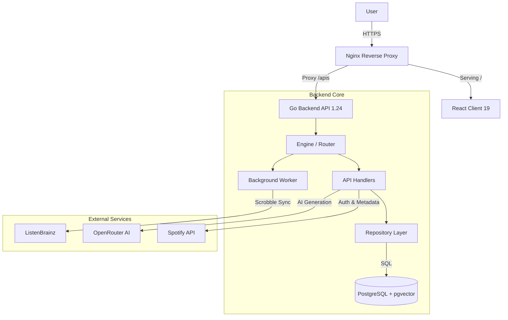

# 🎵 Beat Scrobble

<p align="center">
  
</p>

<p align="center">
  <b>Modern, Colorful, Self-Hosted Music Analytics Platform</b><br/>
  <i>Your music, your data, your insights. Powered by smart AI with zero wasted tokens.</i>
</p>

<p align="center">
  <a href="https://pkg.go.dev/github.com/SaturnX-Dev/Beat-Scrobble"></a>
  <a href="API_DOCUMENTATION.md"></a>
  <a href="LICENSE"></a>
  
  
  
</p>

---

## ✨ Features

### 🎯 Core Platform

| Feature | Description |
| :--- | :--- |
| **🔗 ListenBrainz Compatible** | Seamless integration with any LB-compatible scrobbler. Just point your client to your server URL. |
| **📥 Multi-Source Import** | One-click import from Spotify, Last.fm, ListenBrainz, and Maloja. Smart deduplication included. |
| **📡 Relay Mode** | Automatically forward your scrobbles to other services like ListenBrainz or Maloja (Proxy Mode). |
| **🔐 Full Data Ownership** | Self-hosted architecture. Your data stays 100% yours, stored locally in PostgreSQL. |
| **👥 Multi-User Support** | Complete user isolation. Admins can manage users, roles, and quotas via a dedicated UI. |

### 🤖 AI-Powered Features

<details open>
<summary><b>🧠 AI Music Critique & Analysis</b></summary>

Get witty, personalized AI reviews of your tracks and listening habits.

- **Track Critiques**: AI commentary on individual songs derived from metadata and audio features.
- **Profile Critique**: Deep analysis of your listening personality based on your history.
- **Smart Caching**: Critiques are cached indefinitely. Zero wasted tokens on repeat generation.
- **OpenRouter Integration**: Use GPT-4, Claude, Gemini, or any LLM of your choice.
</details>

<details>
<summary><b>🎵 AI Playlists (7 Types)</b></summary>

| Playlist | Description |
| :--- | :--- |
| **🎭 Mood Mix** | Curated tracks perfectly matching a specific emotional tone. |
| **🎸 Genre Dive** | Deep exploration into the nuances of specific genres. |
| **💡 Discover Weekly** | Fresh new music recommendations based on your taste. |
| **⏳ Time Capsule** | A nostalgic throwback to a randomly selected past era. |
| **📻 Artist Radio** | Continuous mix of similar artists to your favorites. |
| **📅 Decade Mix** | The absolute best tracks from a specific decade. |
| **💎 Hidden Gems** | Underplayed tracks in your library that deserve more love. |
</details>

<details>
<summary><b>🔮 Semantic Search (pgvector)</b></summary>

- **Vector Embeddings**: Tracks, artists, and albums are stored as vectors.
- **Vibe-Based Search**: Search for "Sad songs from the 90s" or "Upbeat workout music".
- **Similar Users**: Find other users on your instance with compatible taste.
</details>

### 📊 Analytics & Visualizations

Beat Scrobble offers **15+ interactive visualizations** to explore your listening data.

#### 🗓️ Activity & History

| Visualization | Description |
| :--- | :--- |
| **🧩 Activity Grid** | GitHub-style heatmap showing listening intensity. Darker = more listens. |
| **📜 Timeline View** | Infinite-scroll chronological history with art thumbnails and **swipe-to-delete**. |
| **🎧 Listening Sessions** | Smart grouping of consecutive listens into sessions with duration analysis. |

#### 📈 Rankings & Charts

| Visualization | Description |
| :--- | :--- |
| **📊 TopListChart** | Animated horizontal bar chart for top tracks/albums/artists (Day/Week/Month/Year). |
| **📈 ListeningTrends** | SVG area chart showing volume evolution over time. |
| **🧱 The Wall** | Aesthetic grid layout of top 50 artists with hover stats. |

#### 🎨 Creative Visualizations

| Visualization | Description |
| :--- | :--- |
| **🫧 ArtistBubbles** | Physics-based circle-packing diagram. Size = Play Count. |
| **🖼️ AlbumQuilt** | Mosaic collage of top album covers with glow effects. |
| **🌊 StreamGraph** | Stacked area waves showing artist popularity battles over time. |
| **☁️ Genre Cloud** | Word cloud of your top genres. Larger text = Higher frequency. |

#### 📉 Data Insights

| Visualization | Description |
| :--- | :--- |
| **📉 ScatterPlot** | Time-of-day vs Day-of-week analysis of your listening habits. |
| **🕹️ Music Decades** | Retro striped bar chart showing distribution by release decade. |
| **🍩 Music Ratio** | Radial breakdown of unique tracks vs albums vs artists. |
| **🧬 Listening Fingerprint** | Radar chart visualizing audio features (Energy, Danceability, etc). |

#### 🎯 Dashboard Features

| Feature | Description |
| :--- | :--- |
| **🎛️ Control Room** | Unified dashboard with Now Playing, metrics, and mini-charts. |
| **🎁 Yearly Recap** | "Spotify Wrapped" style annual summary with shareable stats. |
| **� Period Filters** | Instant filtering: Today, Week, Month, Year, All Time. |
| **▶️ Now Playing** | Real-time player with AI critique and quick actions. |

---

## �🚀 Quick Start

### Docker (Recommended)

```bash
# Clone the repository
git clone https://github.com/SaturnX-Dev/Beat-Scrobble.git
cd Beat-Scrobble

# Configure environment
cp .env.example .env
# Edit .env with your settings

# Start with Docker Compose
docker compose -f docker-compose.prod.yml up -d
```

### Docker Compose (Simple)

Ideal for quick deployment.

```yaml
services:
  beat-scrobble:
    image: saturnxdev/beat-scrobble:latest
    container_name: beat-scrobble
    restart: unless-stopped
    ports:
      - "4110:4110"
    environment:
      - BEAT_SCROBBLE_DATABASE_URL=postgres://postgres:password@db:5432/beatscrobble
      - BEAT_SCROBBLE_ALLOWED_HOSTS=localhost,127.0.0.1
    volumes:
      - ./data:/app/data
      - ./config:/etc/beat_scrobble
    depends_on:
      - db

  db:
    image: pgvector/pgvector:pg16
    container_name: beat-scrobble-db
    restart: unless-stopped
    environment:
      POSTGRES_DB: beatscrobble
      POSTGRES_PASSWORD: password
    volumes:
      - ./db-data:/var/lib/postgresql/data
```

### Docker Compose (Complete / Advanced)

Full configuration showcasing all available capabilities.

```yaml
services:
  beat-scrobble:
    image: saturnxdev/beat-scrobble:latest
    container_name: beat-scrobble
    restart: unless-stopped
    ports:
      - "4110:4110"
    environment:
      # --- Core Configuration ---
      - BEAT_SCROBBLE_DATABASE_URL=postgres://postgres:password@db:5432/beatscrobble
      - BEAT_SCROBBLE_LISTEN_PORT=4110
      - BEAT_SCROBBLE_BIND_ADDR=0.0.0.0
      - BEAT_SCROBBLE_ALLOWED_HOSTS=beatscrobble.local,localhost
      - BEAT_SCROBBLE_CORS_ALLOWED_ORIGINS=http://beatscrobble.local,http://localhost:4110
      - BEAT_SCROBBLE_CONFIG_DIR=/etc/beat_scrobble
      
      # --- Security & Auth ---
      - BEAT_SCROBBLE_DEFAULT_USERNAME=admin
      - BEAT_SCROBBLE_DEFAULT_PASSWORD=changeme
      - BEAT_SCROBBLE_LOGIN_GATE=true          # If true, blocks public routes until login
      - PUID=1000                              # User ID for file permissions
      - PGID=1000                              # Group ID for file permissions

      # --- External Services ---
      - BEAT_SCROBBLE_MUSICBRAINZ_URL=https://musicbrainz.org
      - BEAT_SCROBBLE_MUSICBRAINZ_RATE_LIMIT=1 # Requests per second
      - BEAT_SCROBBLE_DISABLE_MUSICBRAINZ=false
      - BEAT_SCROBBLE_DISABLE_COVER_ART_ARCHIVE=false
      - BEAT_SCROBBLE_DISABLE_DEEZER=false
      
      # --- Performance ---
      - BEAT_SCROBBLE_ENABLE_FULL_IMAGE_CACHE=true
      - BEAT_SCROBBLE_THROTTLE_IMPORTS_MS=0    # Delay between import batches (0 = fast)
      - BEAT_SCROBBLE_ENABLE_STRUCTURED_LOGGING=true
      - BEAT_SCROBBLE_LOG_LEVEL=info           # debug, info, warn, error, fatal

      # --- Relay Mode (ListenBrainz) ---
      - BEAT_SCROBBLE_ENABLE_LBZ_RELAY=false
      # - BEAT_SCROBBLE_LBZ_RELAY_URL=https://api.listenbrainz.org
      # - BEAT_SCROBBLE_LBZ_RELAY_TOKEN=your_token_here

      # --- Custom Import Logic ---
      - BEAT_SCROBBLE_SKIP_IMPORT=false
      - BEAT_SCROBBLE_FETCH_IMAGES_DURING_IMPORT=true
      - BEAT_SCROBBLE_ARTIST_SEPARATORS_REGEX=\s+·\s+;;\s+feat\.\s+
      
    volumes:
      - ./data:/app/data
      - ./config:/etc/beat_scrobble
      - ./import:/etc/beat_scrobble/import    # Place files here for auto-import
    depends_on:
      - db

  db:
    image: pgvector/pgvector:pg16
    container_name: beat-scrobble-db
    restart: unless-stopped
    shm_size: 256mb                            # Recommended for larger databases
    environment:
      POSTGRES_DB: beatscrobble
      POSTGRES_PASSWORD: password
      POSTGRES_USER: postgres
    volumes:
      - ./db-data:/var/lib/postgresql/data
    healthcheck:
      test: ["CMD-SHELL", "pg_isready -U postgres"]
      interval: 10s
      timeout: 5s
      retries: 5
```

### Build from Source

```bash
# Backend
go build -o beat-scrobble ./cmd/api

# Frontend
cd client && npm install && npm run build
```

---

## 🎨 Premium UI & Customization

| Feature | Description |
| :--- | :--- |
| **📱 Mobile-First** | Optimized bottom nav and responsive layouts. |
| **✨ Aura Styles** | 32+ dynamic visual effects and gradients. |
| **🌗 Auto Theme** | Smart time-based automatic Day/Night switching. |
| **🖼️ Backgrounds** | Support for custom uploaded images or looping videos. |
| **💎 Glassmorphism** | Modern, sleek glass card aesthetics. |

### Built-in Themes
Midnight, Snow, Ocean, Forest, Sunset, Neon, Retro, Minimal, and more...

---

## 🎵 Spotify Integration

Enrich your library with comprehensive Spotify metadata.

| Feature | Description |
| :--- | :--- |
| **🎤 Artist Metadata** | Genres, popularity scores, follower counts, and bio |
| **💿 Album Metadata** | Genres, popularity, release details, and record labels |
| **🎼 Track Metadata** | BPM, Key, Energy, Danceability, Mood, Acousticness, etc. |
| **🎚️ Audio Grid** | Visual breakdown of track features on every track page |
| **📡 Fetch Terminal** | Real-time SSE-powered bulk metadata fetching terminal |
| **💾 Import** | Independent backup/restore for your Spotify metadata mapping |

**Data Display:**
- **Artist Page**: Genres badges, popularity %, followers count, bio
- **Album Page**: Genres badges, popularity %, release date, label
- **Track Page**: Audio features grid showing BPM, Key, Energy, Danceability, Mood, Acoustic, Instrumental, Speech, Live

**Bulk Fetch Optimization (Hybrid Architecture):**
- **Foreground (Fast):** Immediately fetches Top 100 Artists, Albums, and Tracks for instant dashboard population.
- **Background (Stealth):** Spawns a silent worker to process the *entire library* (pages 2+) with intelligent rate limiting (1.5s/batch) to avoid API bans.
- **Global Notifications:** Premium UI alerts notify you when background sync completes via real-time heartbeat system.
- **Batches:** 50 items/batch. Fallback to search for missing IDs.
- **Auto-Search & Link:** Tracks without a Spotify ID are automatically searched and linked during metadata refresh.

**Setup:**
1. Create app at [Spotify Developer Dashboard](https://developer.spotify.com/dashboard)
2. Enter Client ID & Secret in Settings → APIs → Spotify
3. Click "Open Fetch Terminal" for bulk metadata fetch

---

## ☁️ Server-Side Storage

All preferences sync across devices:
- ✅ Themes & Aura settings
- ✅ Custom colors & backgrounds
- ✅ Profile images
- ✅ AI cache & preferences

---

## 🔗 Public Profiles

Share your stats at `/u/username`:
- Visitors see YOUR theme and customizations
- Profile image displayed
- Full stats visible

---

## ⚡ Performance

Beat Scrobble is engineered for speed with millions of scrobbles:

### Backend Optimizations
| Optimization | Impact |
| :--- | :--- |
| **📦 Materialized Views** | Pre-aggregated stats for instant reporting |
| **🔍 Full-Text Search** | tsvector w/ triggers for <10ms search results |
| **⚡ Compound Indexes** | Optimized `(user_id, listened_at)` lookups |
| **🛡️ User Isolation** | Row-level security logic via `user_id` filters |
| **🗜️ Gzip Compression** | 10x smaller API JSON payloads |
| **🎱 Connection Pooling** | Tuned pgx pool for high-concurrency |
| **🧵 Async Workers** | Go channels for non-blocking background imports |

### Frontend Optimizations
| Optimization | Impact |
| :--- | :--- |
| **🚄 Virtualization** | Efficient rendering of massive lists (10k+ items) |
| **✂️ Code Splitting** | `React.lazy` implementation for fast initial load |
| **⚡ Optimistic UI** | Instant feedback before server confirmation |
| **💾 Persistent Cache** | TanStack Query syncing to localStorage |
| **🖼️ Lazy Images** | IntersectionObserver for viewport-only loading |

---

## ⚙️ Configuration

### User Management
Admins have access to a dedicated **Users** tab in Settings.
- **Create/Delete Users**: Manage access to your instance.
- **Roles**: Assign `User` or `Admin` roles.
- **Quotas**: `MAX_USERS` env var limits signups.

### Environment Variables

| Variable | Description | Default |
| :--- | :--- | :--- |
| `BEAT_SCROBBLE_DATABASE_URL` | PostgreSQL connection string | **Required** |
| `BEAT_SCROBBLE_ALLOWED_HOSTS` | Comma-separated allowed hosts | `localhost` |
| `BEAT_SCROBBLE_LISTEN_PORT` | Application server port | `4110` |
| `PUID` | User ID for permission handling | `1000` |
| `PGID` | Group ID for permission handling | `1000` |
| `OPENAI_API_KEY` | Key for AI features (OpenRouter) | `-` |
| `BEAT_SCROBBLE_LOGIN_GATE` | Block public routes until login | `true` |
| `BEAT_SCROBBLE_DEFAULT_USERNAME` | Admin username for first setup | `admin` |

---

## 🤖 AI Setup

1. Get an API key from [OpenRouter](https://openrouter.ai)
2. Go to **Settings → API Keys**
3. Enter your OpenRouter key
4. Enable: AI Critique, Profile Critique, AI Playlists

### Smart Caching (Token Saver)

| Feature | Refresh Interval | Condition |
| :--- | :---: | :--- |
| **� Now Playing** | Forever | Generated once per track, cached indefinitely |
| **👤 Profile (Day)** | 4 hours | Updates only if new listens occur |
| **👤 Profile (Week)** | 3 days | Updates only if new listens occur |
| **👤 Profile (Long)** | 7 days | Updates only if new listens occur |
| **🎶 AI Playlists** | 7 days | Regenerates weekly or on manual request |

---

## 📦 Backup & Import

Beat Scrobble supports a robust import system that respects user isolation.

### Supported Formats

| Source | Format | Notes |
| :--- | :--- | :--- |
| **Beat Scrobble V2** | Full JSON Backup | Includes listens, preferences, theme, and AI cache. |
| **Koito (Legacy)** | V1 JSON Export | Listens only. Legacy format support. |
| **Last.fm** | Official CSV Export | Imports scrobbles with timestamps. |
| **ListenBrainz** | Official JSON Export | Full history import. |
| **Spotify** | Streaming History (JSON) | "Extended Streaming History" recommended. |
| **Maloja** | Native JSON Backup | Compatible with Maloja exports. |

### How to Import
1. Navigate to **Settings → Backup**.
2. Upload your export file.
3. The system will automatically detect the format (V2 vs Legacy vs External).
4. **V2 Backups** restore your entire profile state (Themes, AI Settings).
5. **Files are queued** and processed in the background by the Worker.

---

## 🛠️ API Reference

See the complete [API Documentation](API_DOCUMENTATION.md) for detailed endpoint usage.

| Component | Base Path | Description |
| :--- | :--- | :--- |
| **Web API** | `/apis/web/v1` | Core application endpoints (Auth, Data, AI) |
| **ListenBrainz** | `/apis/listenbrainz/1` | Compatible scrobble submission endpoint |
| **Static** | `/images`, `/profile-images` | Optimized asset delivery |

---

## 🐳 Production Deployment

### With Nginx (Recommended)

```bash
docker compose -f docker-compose.prod.yml up -d
```

Includes:
- **Nginx** - Reverse proxy with edge caching
- **App** - Beat Scrobble (Alpine, ~50MB)
- **DB** - PostgreSQL 16 with pgvector

### Edge Caching

The included `nginx.conf` provides:
- **30-day image cache** - Album/artist images
- **Gzip compression** - All text responses
- **Rate limiting** - API protection
- **Security headers** - XSS, clickjacking protection

---

## 🏗️ Architecture



---

## 📸 Screenshots

<p align="center">
  
  
</p>
<p align="center">
  
  
</p>

---

## 🙏 Credits

- **Original Project**: [Koito](https://github.com/gabehf/koito) by Gabe Farrell
- **Fork Maintainer**: [SaturnX-Dev](https://github.com/SaturnX-Dev)
- **Contributors**: See [CREDITS.md](CREDITS.md) for full list.
- **Roadmap**: Check [BEAT_SCROBBLE_ROADMAP.md](BEAT_SCROBBLE_ROADMAP.md) for future plans.

---

## 📄 License

MIT License - See [LICENSE](LICENSE) for details.

<p align="center">
  <b>Beat Scrobble</b> - <a href="https://github.com/SaturnX-Dev/Beat-Scrobble">Star us on GitHub!</a>
</p>
