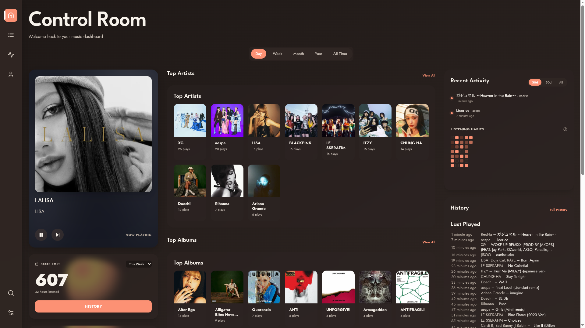
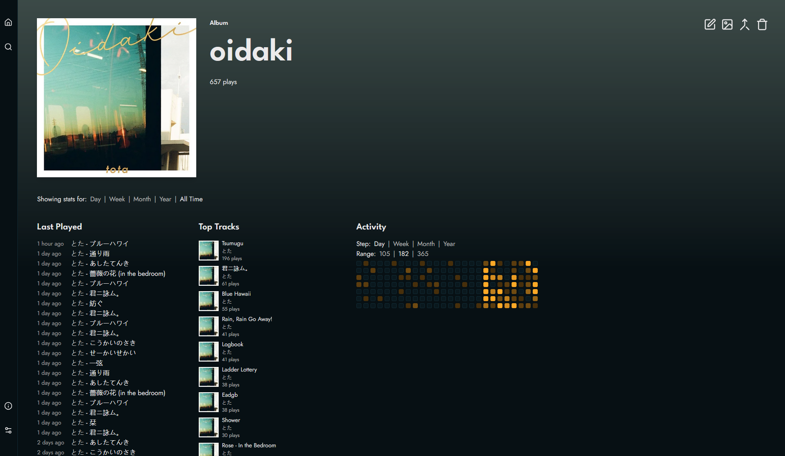
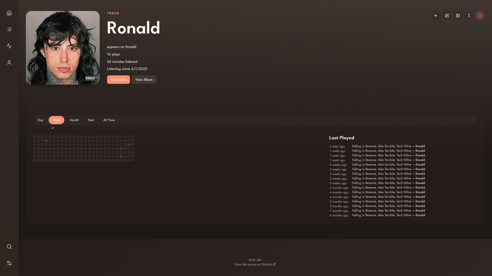
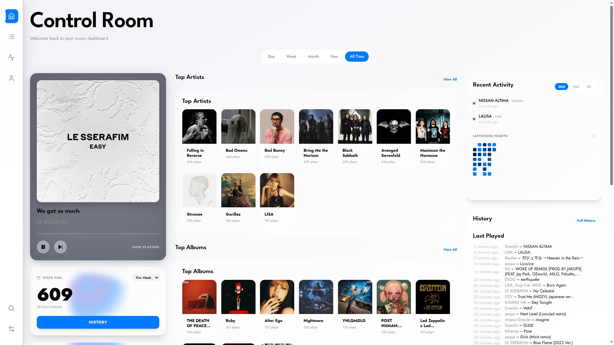

# 🎵 Beat Scrobble

<p align="center">
  
</p>

<p align="center">
  <b>Modern, Colorful, Self-Hosted Music Analytics Platform</b><br/>
  <i>Your music, your data, your insights. Powered by smart AI with zero wasted tokens.</i>
</p>

<p align="center">
  <a href="https://pkg.go.dev/github.com/SaturnX-Dev/Beat-Scrobble"></a>
  <a href="LICENSE"></a>
  
  
  
</p>

---

## 🚀 Quick Start

### Docker (Recommended)

```bash
# Clone the repository
git clone https://github.com/SaturnX-Dev/Beat-Scrobble.git
cd Beat-Scrobble

# Configure environment
cp .env.example .env
# Edit .env with your settings

# Start with Docker Compose
docker compose -f docker-compose.prod.yml up -d
```

### Docker Compose (Simple)

```yaml
services:
  beat-scrobble:
    image: saturnxdev/beat-scrobble:latest
    ports:
      - "4110:4110"
    environment:
      - BEAT_SCROBBLE_DATABASE_URL=postgres://postgres:password@db:5432/beatscrobble
    volumes:
      - ./data:/app/data
    depends_on:
      - db

  db:
    image: pgvector/pgvector:pg16
    environment:
      POSTGRES_DB: beatscrobble
      POSTGRES_PASSWORD: password
    volumes:
      - ./db-data:/var/lib/postgresql/data
```

### Build from Source

```bash
# Backend
go build -o beat-scrobble ./cmd/api

# Frontend
cd client && npm install && npm run build
```

---

## 🏗️ Architecture

```mermaid
graph TD
    User[User] -->|HTTPS| Nginx[Nginx Reverse Proxy]
    Nginx -->|Serving /| Client[React Client (SPA)]
    Nginx -->|Proxy /apis| API[Go Backend API]
    
    subgraph "Backend Core"
        API --> Engine[Engine / Router]
        Engine --> Handlers[API Handlers]
        Handlers --> Repo[Repository Layer]
        Repo -->|SQL| DB[(PostgreSQL + pgvector)]
    end
    
    subgraph "External Services"
        Handlers -->|Auth & Metadata| Spotify[Spotify API]
        Handlers -->|AI Generation| OpenRouter[OpenRouter AI]
        Handlers -->|Scrobble Sync| LB[ListenBrainz]
        Handlers -->|Metadata| MBZ[MusicBrainz]
    end
```

---

## ✨ Features

### 🎯 Core Platform
| Feature | Description |
| :--- | :--- |
| **🔗 ListenBrainz Compatible** | Seamless integration with any LB-compatible scrobbler |
| **📥 Multi-Source Import** | One-click import from Spotify, Last.fm, ListenBrainz, and Maloja |
| **📡 Relay Mode** | Automatically forward your scrobbles to other services |
| **🔐 Full Data Ownership** | Self-hosted architecture; your data stays 100% yours |

---

### 🤖 AI-Powered Features

<details>
<summary><b>🧠 AI Music Critique</b></summary>

Get witty, personalized AI reviews of your tracks and listening habits.

- **Track Critiques** - AI commentary on individual songs
- **Profile Critique** - Deep analysis of your listening personality
- **Smart Caching** - Critiques cached indefinitely, zero repeat token usage
- **OpenRouter Integration** - Use GPT-4, Claude, Gemini, or any LLM

</details>

<details>
<summary><b>🎵 AI Playlists (7 Types)</b></summary>

| Playlist | Description |
| :--- | :--- |
| **🎭 Mood Mix** | Curated tracks perfectly matching a specific emotional tone |
| **🎸 Genre Dive** | Deep exploration into the nuances of specific genres |
| **💡 Discover Weekly** | Fresh new music recommendations based on your taste |
| **⏳ Time Capsule** | A nostalgic throwback to a randomly selected past era |
| **📻 Artist Radio** | Continuous mix of similar artists to your favorites |
| **📅 Decade Mix** | The absolute best tracks from a specific decade |
| **💎 Hidden Gems** | Underplayed tracks in your library that deserve more love |

</details>

<details>
<summary><b>🔮 Semantic Search (pgvector)</b></summary>

- **Vector Embeddings** - Tracks, artists, albums stored as vectors
- **Vibe-Based Search** - "Sad songs from the 90s"
- **Similar Users** - Find people with your taste
- **Recommendations** - AI-powered discovery

</details>

---

### 📊 Analytics & Visualizations

Beat Scrobble offers **15+ interactive visualizations** to explore your listening data:

#### 🗓️ Activity & History

| Visualization | Description |
| :--- | :--- |
| **🧩 Activity Grid** | GitHub-style heatmap showing listening intensity. Darker = more listens. |
| **📜 Timeline View** | Infinite-scroll chronological history with art thumbnails and **swipe-to-delete**. |
| **🎧 Listening Sessions** | Smart grouping of consecutive listens into sessions with duration analysis. |

#### 📈 Rankings & Charts

| Visualization | Description |
| :--- | :--- |
| **📊 TopListChart** | Animated horizontal bar chart for top tracks/albums/artists. |
| **📈 ListeningTrends** | SVG area chart showing volume evolution over time (Day/Week/Month). |
| **🧱 The Wall** | Aesthetic grid layout of top 50 artists with hover stats. |

#### 🎨 Creative Visualizations

| Visualization | Description |
| :--- | :--- |
| **🫧 ArtistBubbles** | Physics-based circle-packing diagram. Size = Play Count. |
| **🖼️ AlbumQuilt** | Mosaic collage of top album covers with glow effects. |
| **🌊 StreamGraph** | Stacked area waves showing artist popularity battles over time. |
| **☁️ Genre Cloud** | Word cloud of your top genres. Larger text = Higher frequency. |

#### 📉 Data Insights

| Visualization | Description |
| :--- | :--- |
| **📉 ScatterPlot** | Time-of-day vs Day-of-week analysis of your listening habits. |
| **🕹️ Music Decades** | Retro striped bar chart showing distribution by release decade. |
| **🍩 Music Ratio** | Radial breakdown of unique tracks vs albums vs artists. |
| **🧬 Listening Fingerprint** | Radar chart visualizing audio features (Energy, Danceability, etc). |

#### 🎯 Dashboard Features

| Feature | Description |
| :--- | :--- |
| **🎛️ Control Room** | Unified dashboard with Now Playing, metrics, and mini-charts. |
| **🎁 Yearly Recap** | "Spotify Wrapped" style annual summary with shareable stats. |
| **📅 Period Filters** | Instant filtering: Today, Week, Month, Year, All Time. |
| **▶️ Now Playing** | Real-time player with AI critique and quick actions. |


---

### 🎨 Premium UI & Customization

| Feature | Description |
| :--- | :--- |
| **📱 Mobile-First** | Optimized bottom nav and responsive layouts for any device |
| **✨ Aura Styles** | 32+ dynamic visual effects and gradients behind cards |
| **🌗 Auto Theme** | Smart time-based automatic Day/Night theme switching |
| **🎨 Custom Colors** | Granular control over 10+ UI color elements |
| **🖼️ Backgrounds** | Support for custom uploaded images or looping video backgrounds |
| **👤 Profile Images** | Personalized profile pictures for social identity |
| **💎 Glassmorphism** | Modern, sleek glass card aesthetics with blur effects |

### Built-in Themes
Midnight, Snow, Ocean, Forest, Sunset, Neon, Retro, Minimal, and more...

---

### 🎵 Spotify Integration

Enrich your library with comprehensive Spotify metadata.

| Feature | Description |
| :--- | :--- |
| **🎤 Artist Metadata** | Genres, popularity scores, follower counts, and bio |
| **💿 Album Metadata** | Genres, popularity, release details, and record labels |
| **🎼 Track Metadata** | BPM, Key, Energy, Danceability, Mood, Acousticness, etc. |
| **🎚️ Audio Grid** | Visual breakdown of track features on every track page |
| **📡 Fetch Terminal** | Real-time SSE-powered bulk metadata fetching terminal |
| **💾 Import/Export** | Independent backup/restore for your Spotify metadata mapping |

**Data Display:**
- **Artist Page**: Genres badges, popularity %, followers count, bio
- **Album Page**: Genres badges, popularity %, release date, label
- **Track Page**: Audio features grid showing BPM, Key, Energy, Danceability, Mood, Acoustic, Instrumental, Speech, Live

**Bulk Fetch Optimization (Hybrid Architecture):**
- **Foreground (Fast):** Immediately fetches Top 100 Artists, Albums, and Tracks for instant dashboard population.
- **Background (Stealth):** Spawns a silent worker to process the *entire library* (pages 2+) with intelligent rate limiting (1.5s/batch) to avoid API bans.
- **Global Notifications:** Premium UI alerts notify you when background sync completes via real-time heartbeat system.
- **Batches:** 50 items/batch. Fallback to search for missing IDs.
- **Auto-Search & Link:** Tracks without a Spotify ID are automatically searched and linked during metadata refresh.

**Setup:**
1. Create app at [Spotify Developer Dashboard](https://developer.spotify.com/dashboard)
2. Enter Client ID & Secret in Settings → APIs → Spotify
3. Click "Open Fetch Terminal" for bulk metadata fetch
4. Use "Import/Export Metadata" section to backup/restore metadata

---

### ☁️ Server-Side Storage

All preferences sync across devices:
- ✅ Themes & Aura settings
- ✅ Custom colors & backgrounds
- ✅ Profile images
- ✅ AI cache & preferences

---

### 🔗 Public Profiles

Share your stats at `/u/username`:
- Visitors see YOUR theme and customizations
- Profile image displayed
- Full stats visible

---

## ⚡ Performance

Beat Scrobble is engineered for speed with millions of scrobbles:

### Backend Optimizations
| Optimization | Impact |
| :--- | :--- |
| **📦 Materialized Views** | Pre-aggregated stats for instant reporting |
| **🔍 Full-Text Search** | tsvector w/ triggers for <10ms search results |
| **⚡ Compound Indexes** | Optimized `(user_id, listened_at)` lookups |
| **🛡️ User Isolation** | Row-level security logic via `user_id` filters |
| **🗜️ Gzip Compression** | 10x smaller API JSON payloads |
| **🎱 Connection Pooling** | Tuned pgx pool for high-concurrency |
| **🧵 Async Workers** | Go channels for non-blocking background imports |

### Frontend Optimizations
| Optimization | Impact |
| :--- | :--- |
| **🚄 Virtualization** | Efficient rendering of massive lists (10k+ items) |
| **✂️ Code Splitting** | `React.lazy` implementation for fast initial load |
| **⚡ Optimistic UI** | Instant feedback before server confirmation |
| **💾 Persistent Cache** | TanStack Query syncing to localStorage |
| **🖼️ Lazy Images** | IntersectionObserver for viewport-only loading |

### Docker Image
- **Alpine-based** - ~50MB (vs 500MB+ with Debian)
- **Non-root user** - Security hardened with PUID/PGID support
- **Health checks** - Built-in `/health` endpoint

---

## ⚙️ Configuration

### Environment Variables

| Variable | Description | Default |
| :--- | :--- | :--- |
| `BEAT_SCROBBLE_DATABASE_URL` | PostgreSQL connection string | **Required** |
| `BEAT_SCROBBLE_ALLOWED_HOSTS` | Comma-separated allowed hosts | `localhost` |
| `BEAT_SCROBBLE_PORT` | Application server port | `4110` |
| `PUID` | User ID for permission handling (Synology/NAS) | `1000` |
| `PGID` | Group ID for permission handling (Synology/NAS) | `1000` |
| `OPENAI_API_KEY` | Key for AI features (OpenRouter) | `-` |
| `SPOTIFY_CLIENT_ID` | Spotify application Client ID | `-` |
| `SPOTIFY_CLIENT_SECRET` | Spotify application Client Secret | `-` |

---

## 🤖 AI Setup

1. Get an API key from [OpenRouter](https://openrouter.ai)
2. Go to **Settings → API Keys**
3. Enter your OpenRouter key
4. Enable: AI Critique, Profile Critique, AI Playlists

### Smart Caching (Token Saver)

Beat Scrobble implements intelligent server-side caching to minimize API calls:

| Feature | Refresh Interval | Condition |
| :--- | :---: | :--- |
| **📝 Now Playing** | Forever | Generated once per track, cached indefinitely |
| **👤 Profile (Day)** | 4 hours | Updates only if new listens occur |
| **👤 Profile (Week)** | 3 days | Updates only if new listens occur |
| **👤 Profile (Long)** | 7 days | Updates only if new listens occur |
| **🎶 AI Playlists** | 7 days | Regenerates weekly or on manual request |

**Smart Features:**
- ✅ **Presence Detection** - Critiques only generated when app is open (heartbeat every 20 sec)
- ✅ **Change Detection** - Cache invalidates only when your data actually changes
- ✅ **Prompt Isolation** - Changing one prompt only clears that prompt's cache
- ✅ **Cross-Device Sync** - Cache shared across all your devices

---


## 📦 Backup & Import

### Supported Formats

| Source | Format |
| :--- | :--- |
| **Beat Scrobble** | v1 (Legacy) & v2 (Full Backup) |
| **Last.fm** | Official CSV Export |
| **ListenBrainz** | Official JSON Export |
| **Maloja** | Native JSON Backup |
| **Spotify** | Extended Streaming History (JSON) |

### How to Import
1. Go to **Settings → Backup**
2. Upload your export file
3. Or place files in `/etc/beat_scrobble/import`

---

## 🛠️ API Reference

See the complete [API Documentation](API_DOCUMENTATION.md) for detailed endpoint usage.

| Component | Base Path | Description |
| :--- | :--- | :--- |
| **Web API** | `/apis/web/v1` | Core application endpoints (Auth, Data, AI) |
| **ListenBrainz** | `/apis/listenbrainz/1` | Compatible scrobble submission endpoint |
| **Static** | `/images`, `/profile-images` | Optimized asset delivery |

---

## 🐳 Production Deployment

### With Nginx (Recommended)

```bash
docker compose -f docker-compose.prod.yml up -d
```

Includes:
- **Nginx** - Reverse proxy with edge caching
- **App** - Beat Scrobble (Alpine, ~50MB)
- **DB** - PostgreSQL 16 with pgvector

### Edge Caching

The included `nginx.conf` provides:
- **30-day image cache** - Album/artist images
- **Gzip compression** - All text responses
- **Rate limiting** - API protection
- **Security headers** - XSS, clickjacking protection

---

## 📸 Screenshots

<p align="center">
  
  
</p>
<p align="center">
  
  
</p>

---

## 🙏 Credits

- **Original Project**: [Koito](https://github.com/gabehf/koito) by Gabe Farrell
- **Fork Maintainer**: [SaturnX-Dev](https://github.com/SaturnX-Dev)
- **Contributors**: See [CREDITS.md](CREDITS.md) for full list.
- **Roadmap**: Check [BEAT_SCROBBLE_ROADMAP.md](BEAT_SCROBBLE_ROADMAP.md) for future plans.

---

## 📄 License

MIT License - See [LICENSE](LICENSE) for details.

---

<p align="center">
  <b>Beat Scrobble</b> - Your music, your data, your insights.<br/>
  ⭐ Star this repo if you find it useful!
</p>